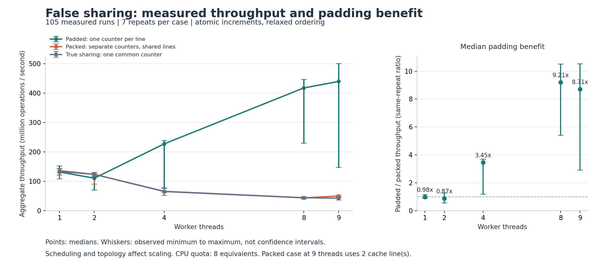

# False Sharing: Results and Notes

## Setup

| Item | Value |
|---|---|
| Machine | Cloud Linux VM, not my laptop |
| CPU | Intel Xeon Platinum 8573C under KVM, 9 vCPUs, quota of 8 CPUs (`cpu.max = 800000 100000`) |
| Cache line | 64 bytes (from sysfs) |
| OS / kernel | Ubuntu 24.04.3 / Linux 6.18.44 |
| Compiler | g++ 13.3.0, `-O3 -std=c++20 -pthread -Wall -Wextra -Wpedantic` |
| Clock | `std::chrono::steady_clock` |
| Run | 2026-10-08, 3 modes x 5 thread counts x 7 repeats = 105 runs |

Full `lscpu` output and build command are in [measured-results/environment.txt](measured-results/environment.txt).

## Method

1. Check the layout at runtime: counter addresses, stride, and how many cache lines are in use.
2. Warm up each mode and thread count with 200,000 increments per thread. Warmups are not recorded.
3. For each of 7 rounds, shuffle the 15 cases (fixed seed) and run them.
4. In each run, create the threads, pin thread i to CPU i, and wait until all are ready. Then open the start gate.
5. Each thread does 10,000,000 `fetch_add(1, relaxed)` calls on its counter and records its end time.
6. Elapsed time is from just before the gate opens to the last thread's end time. Thread creation and join are not timed.
7. After joining, every counter must equal the iteration count, otherwise the program aborts.

Throughput is `threads * iterations / elapsed_seconds`. Work per thread is fixed, so total work grows with thread count; compare throughput, not elapsed time.

I used an atomic increment in all modes so the shared-counter control has no data race and the compiler cannot fold the loop into a single add. The disassembly in [hot-loop-assembly.txt](measured-results/hot-loop-assembly.txt) shows `lock addq $0x1,(%rdx)` inside the loop.

## Results

Throughput in million increments per second, median of 7 runs.

| Threads | Packed | Padded | True shared | Padded / packed | Packed range | Padded range |
|---:|---:|---:|---:|---:|---:|---:|
| 1 | 136.2 | 131.4 | 132.7 | 0.96x | 130.6-143.5 | 121.0-151.8 |
| 2 | 123.2 | 110.3 | 123.5 | 0.89x | 90.1-130.1 | 70.7-116.4 |
| 4 | 64.8 | 227.0 | 65.6 | 3.50x | 61.7-66.3 | 76.1-239.0 |
| 8 | 43.4 | 417.1 | 43.8 | 9.62x | 42.1-48.3 | 229.4-446.1 |
| 9 | 49.6 | 439.4 | 42.2 | 8.86x | 47.5-53.0 | 147.1-500.2 |

The right-hand panel of the graph pairs packed and padded runs from the same round and takes the median of those ratios, which gives 9.21x at 8 threads instead of 9.62x. Whiskers are min and max, not confidence intervals.

## What I take from it

**Why packed is slow.** The cache works on whole lines, not on variables. When core A writes its counter it needs the line exclusively, which invalidates core B's copy. B then has to fetch the line back to write its own counter, and so on. The counters are different, but the line keeps moving between cores.

| Step | Line on core A | Line on core B |
|---|---|---|
| Both have read it | Shared | Shared |
| A writes counter A | Modified | Invalid |
| B writes counter B | Invalid | Modified |
| A writes counter A again | Modified | Invalid |

This table is the textbook MESI picture, not something I captured from the hardware. A core can do several increments while it holds the line, so one increment does not mean one invalidation.

**4 and 8 threads.** Packed throughput drops as threads are added, while padded keeps climbing. At 8 threads the same 80 million increments take 0.19 s padded and 1.84 s packed.

**Packed is about the same as true sharing.** At 8 threads, 43.4 against 43.8. Separate counters on one line cost almost the same as everyone hammering one counter.

**Padding is not free and does not always help.** At 1 thread there is nothing to fix. At 2 threads padded was about 10% slower, with wide and overlapping ranges, and I cannot say from this data why. Padding also uses 512 bytes for 8 counters instead of 64.

**Padded does not scale linearly either.** 8 threads give 3.2x the 1-thread throughput, not 8x.

## Limits

- It is a VM. Pinning a thread pins it to a vCPU, and I do not know how vCPUs map to physical cores.
- The quota is 8 CPUs, so the 9-thread row is over quota. Packed at 9 threads also uses two lines. I would not read much into that row.
- 38 of the 105 runs saw some cgroup throttling, which is why the padded ranges are so wide.
- No `perf`, so there are no HITM or cache-to-cache counts. The mechanism is inferred from changing only the layout.
- This is an atomic-increment microbenchmark. Real code will show a smaller effect, depending on how often it writes.

A next step would be a bare-metal run with `perf c2c record` on the packed and padded modes separately, to see the line transfers directly.

## References

1. Linux kernel documentation, [False Sharing](https://kernel.org/doc/html/latest/kernel-hacking/false-sharing.html)
2. GCC documentation, [Built-in Functions for Memory Model Aware Atomic Operations](https://gcc.gnu.org/onlinedocs/gcc/_005f_005fatomic-Builtins.html)
