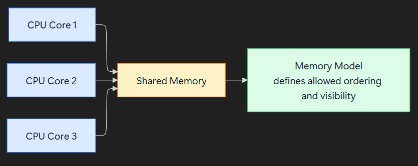
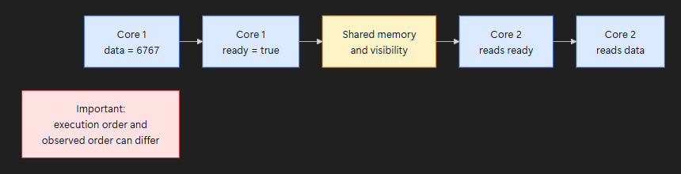
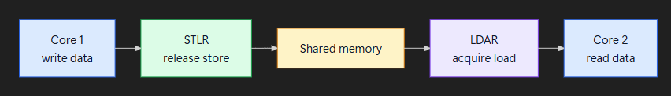
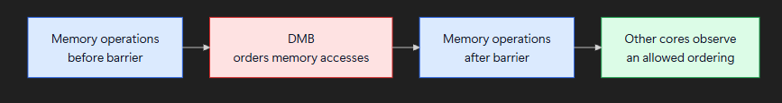
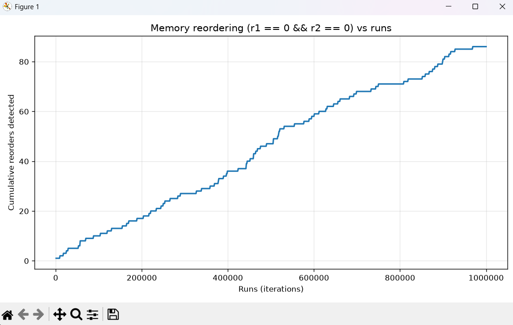
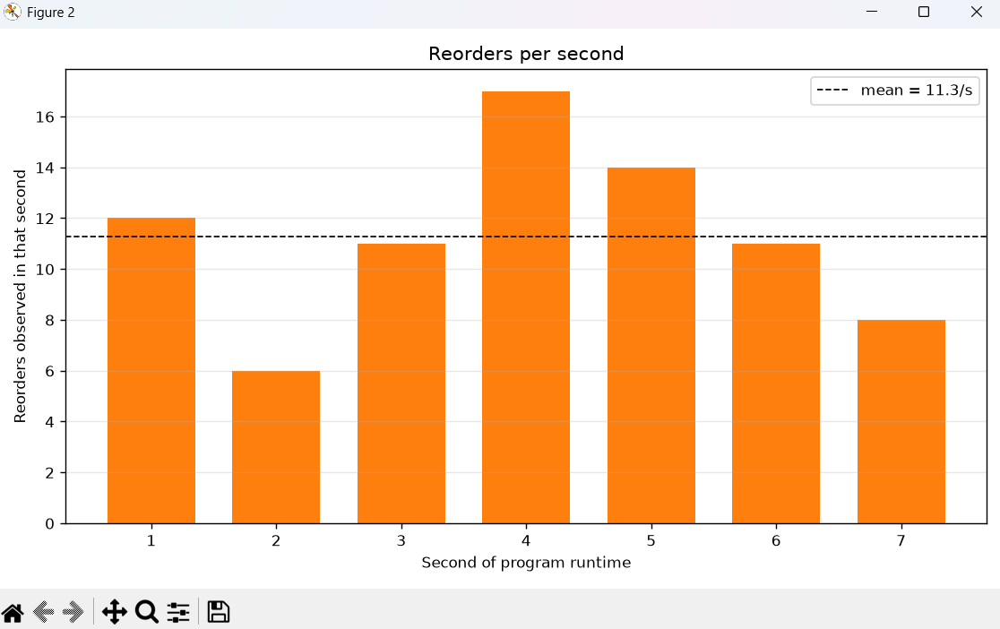

# Memory Model

**Concepts, ARM/AArch64 ordering, visual diagrams, and a C++ memory reordering experiment.**

📓 **Notion page:** [Memory Model on Notion](https://east-seagull-83f.notion.site/Memory-Model-f50f1025503d832a8b6c81c261ab253d?source=copy_link)

---

## Contents

- [Part 1 – Research](#part-1--research)
  - [Basic Definition](#basic-definition)
  - [Real-Life Example](#real-life-example)
  - [Why Is It Important?](#why-is-it-important)
  - [Few Instances of the General Memory Model Concept](#few-instances-of-the-general-memory-model-concept)
  - [ARM / AArch64 Memory Model](#arm--aarch64-memory-model)
  - [Visual Diagrams](#visual-diagrams)
  - [ARM/AArch64 vs x86 vs an Ideal Memory Model](#armaarch64-vs-x86-vs-an-ideal-memory-model)
- [Part 2 – Reordering Experiment (C++)](#part-2--reordering-experiment-c)
  - [What the test does](#what-the-test-does)
  - [Expected output](#expected-output)
  - [Actual output](#actual-output)
  - [Figures](#figures)
  - [Analysis](#analysis)
  - [How to reproduce](#how-to-reproduce)
- [Repository layout](#repository-layout)

---

# Part 1 – Research

*(Content from [Memory Model on Notion](https://east-seagull-83f.notion.site/Memory-Model-f50f1025503d832a8b6c81c261ab253d?source=copy_link).)*

## Basic Definition

A **memory model** is a set of rules that tells us how different parts of a computer can see changes made to shared memory.

## Real-Life Example

Imagine two people sharing a whiteboard.

- Person A writes "The shop is open".
- Then Person A writes "The door is unlocked".
- Person B looks at the whiteboard.

Normally we expect B to see:

```
Shop is open  →  Door is unlocked
```

But if the system allows the changes to be seen in a different order, B could see:

```
Door is unlocked  →  Shop is open
```

The memory model defines the rules for how and when these changes can be seen by the other person.

## Why Is It Important?

Modern computers have multiple CPU cores working at the same time. When two cores use the same data, we need rules that tell us what each core is allowed to see.

For example:

| Core 1 | Core 2 |
| --- | --- |
| `data = 6767` | reads `data` |
| `ready = true` | sees `ready == true` |

We normally expect Core 2 to see:

```
ready = true
data  = 6767
```

But without proper memory ordering, Core 2 could see:

```
ready = true
data  = 0
```

So the memory model tells us what different CPU cores are allowed to see when they work with the same data at the same time.

## Few Instances of the General Memory Model Concept

```
Memory model
│
├── x86-64 memory model
├── ARM/AArch64 memory model
├── RISC-V memory model
└── PowerPC memory model
```

## ARM / AArch64 Memory Model

ARM/AArch64 uses a **weak or relaxed** memory-ordering model.

This means the CPU has more freedom to change the order in which memory operations become visible.

### Important Point

Do not think of ARM as simply:

```
ARM = PSO
ARM = RCsc
ARM = RCpc
```

These are related ideas, but they are not all names for the ARM memory model.

- PSO is a named memory-ordering model.
- RCsc and RCpc describe different consistency semantics used with certain atomic and acquire/release operations.

### Why ARM Is Interesting

ARM allows more freedom in memory ordering than x86-64.

This can give the CPU more freedom to optimize and improve performance, but it also means programmers need to understand memory ordering when working with shared data.

### ARM Ordering Instructions

- **DMB** — Data Memory Barrier
- **DSB** — Data Synchronization Barrier
- **ISB** — Instruction Synchronization Barrier
- **LDAR** — Load-Acquire
- **STLR** — Store-Release
- **LDAXR** — Load-Acquire Exclusive
- **STLXR** — Store-Release Exclusive

### ARM vs Other Architectures

| Architecture | Main Memory Model | Rough Strength |
| --- | --- | --- |
| **x86-64** | TSO | Relatively strong |
| **ARM/AArch64** | Weak / relaxed ordering | Weak |
| **RISC-V** | RVWMO | Weak |
| **Power** | POWER memory model | Very weak |

### Recommended Study Order for AArch64

1. What memory ordering means
2. Why CPUs reorder memory operations
3. ARM weak memory ordering
4. Program order vs observed order
5. Load and store ordering
6. DMB, DSB and ISB
7. Acquire and Release
8. LDAR and STLR
9. RCsc vs RCpc
10. ARM memory types: Normal and Device
11. Shareability
12. ARMv8/AArch64 formal memory model

## Visual Diagrams

### 1. Memory Model: The Big Picture



The memory model does not simply tell us what value is stored in memory.

It tells us which observations and orderings are allowed when multiple cores access shared data.

### 2. How Reordering Can Matter



**The important question is not only "what did Core 1 execute first?"**

We also need to ask "what is Core 2 allowed to observe?"

### 3. ARM Acquire / Release Idea



A simple way to remember it:

- **Release** means earlier memory operations cannot be freely moved after the release operation.
- **Acquire** means later memory operations cannot be freely moved before the acquire operation.

### 4. ARM Barriers



- **DMB** orders memory accesses.
- **DSB** waits for relevant operations to complete.
- **ISB** is related to instruction execution and instruction fetching, rather than normal data-memory ordering.

## ARM/AArch64 vs x86 vs an Ideal Memory Model

| Feature | ARM/AArch64 | x86-64 | Ideal Memory Model |
| --- | --- | --- | --- |
| **Ordering strength** | Weak / relaxed | Relatively strong (TSO) | Very strong |
| **Reordering allowed** | More freedom to reorder | Less freedom to reorder | No observable reordering |
| **Memory visibility** | May need explicit ordering | Usually simpler to reason about | Always follows the expected order |
| **Synchronization** | Acquire/release and barriers | Fewer explicit barriers for common cases | No barriers needed |
| **Performance freedom** | High | Moderate | Low |
| **Programmer difficulty** | Higher | Lower | Lowest |
| **Real-world example** | ARM CPUs, phones and embedded systems | Intel and AMD CPUs | Learning concept, not a real CPU |

> **Note:** The ideal memory model is only a learning concept. Imagine that every memory operation becomes visible in exactly the order the program performed it. Real CPUs allow more freedom because this can help improve performance.

---

# Part 2 – Reordering Experiment (C++)

To see memory reordering happen on real hardware, I ran a C++ litmus test (the classic "store buffering" experiment, adapted from Jeff Preshing's *Memory Reordering Caught in the Act*) and plotted the results with Python.

## What the test does

Two threads each perform one store followed by one load, on two shared variables `X` and `Y` (both start at 0):

| Thread 1 | Thread 2 |
| --- | --- |
| `X = 1` | `Y = 1` |
| `r1 = Y` | `r2 = X` |

In any order where each thread's instructions run in program order, at least one thread must see the other's store, so **`r1 == 0 && r2 == 0` should be impossible**. If we ever observe both `r1 == 0` and `r2 == 0`, a CPU must have let a **load complete before the earlier store became visible** (StoreLoad reordering). That is exactly what the memory model decides is allowed or not.

Experiment setup (`src/ordering_modified.cpp`):

| Setting | Value |
| --- | --- |
| Total measured runs | 1,000,000 |
| Warm-up runs (not counted) | 200,000 |
| Thread pinning | On, each thread on its own logical CPU (`0` and `2`) |
| `USE_CPU_FENCE` | `0` (no `mfence`, only a compiler barrier) |
| `USE_SINGLE_HW_THREAD` | `0` |
| Random start delay | Mersenne Twister, to desynchronise the two threads |
| Sampling | Cumulative reorders logged every 1,000 runs, reorders counted per wall-clock second |

The compiler is stopped from reordering with `asm volatile("" ::: "memory")`, so any reordering we see comes from the **CPU**, not the compiler.

## Expected output

| Configuration | Expected result |
| --- | --- |
| No fence, threads on different cores (this run) | Occasional `r1 == 0 && r2 == 0` detections, so a **small but non-zero** reorder count that keeps growing roughly linearly with the number of runs |
| `USE_CPU_FENCE = 1` (`mfence` between store and load) | **0 reorders**, since the full fence forbids StoreLoad reordering |
| `USE_SINGLE_HW_THREAD = 1` (both threads on one core) | **0 reorders**, since the threads never truly run at the same time |

The rate is expected to be very low (a tiny fraction of a percent of runs), because both threads must hit the window at nearly the same moment.

## Actual output

Console output of the run (cumulative counts taken from `scripts/reorders_vs_runs.txt`):

```
Warm-up of 200000 runs done, starting measurement
100000 runs done, 10 reorders so far
200000 runs done, 17 reorders so far
300000 runs done, 27 reorders so far
400000 runs done, 36 reorders so far
500000 runs done, 47 reorders so far
600000 runs done, 58 reorders so far
700000 runs done, 68 reorders so far
800000 runs done, 71 reorders so far
900000 runs done, 81 reorders so far
1000000 runs done, 86 reorders so far
Done: 86 reorders in 1000000 runs (7.81 s). Data written to reorders_vs_runs.txt and reorders_per_second.txt
```

Summary:

| Metric | Value |
| --- | --- |
| Total runs | 1,000,000 |
| Total reorders | **86** |
| Reorder rate | **0.0086 %** of runs (about 1 in 11,600) |
| Total runtime | 7.814 s |
| Throughput | roughly 110,000 to 137,000 runs per second |
| Mean reorders per second | **11.3 / s** (over the 7 complete seconds) |

Reorders per second, from `scripts/reorders_per_second.txt`:

| Second | Reorders | Runs in that second |
| --- | --- | --- |
| 1 | 12 | 122,011 |
| 2 | 6 | 88,165 |
| 3 | 11 | 136,234 |
| 4 | 17 | 136,845 |
| 5 | 14 | 135,142 |
| 6 | 11 | 136,965 |
| 7 | 8 | 133,119 |
| 8 (partial) | 7 | 111,519 |

## Figures

### Figure 1: Cumulative reorders vs runs



The cumulative count climbs steadily, from 0 to 86 across the 1,000,000 runs, with a few short flat stretches (for example around 700k to 800k runs). The roughly straight line means reordering is a **constant, random per-run probability**, not something that happens in bursts or fades after warm-up.

### Figure 2: Reorders per second



Each bar is the number of reorders in one wall-clock second (the partial last second is dropped from the chart). The dashed line is the mean, **11.3 / s**. The per-second counts vary between 6 and 17, which is the kind of spread you expect from rare random events.

## Analysis

- **Reordering is real and observable.** 86 times out of a million, both threads read the *old* value of the other's variable, which is impossible under strict program-order ("ideal") semantics. This matches the TSO model on x86-64 from Part 1, where a store can sit in the store buffer while a later load runs ahead of it.
- **The compiler barrier is not enough.** The `asm volatile("" ::: "memory")` line only stops the compiler from reordering. The reorders we see happen inside the CPU, which is why a hardware fence (`mfence` here, `DMB` on ARM) is needed.
- **The effect is rare but steady.** About 0.0086 % of runs, at around 11 per second, with no trend over time.
- **Link to ARM.** x86 only relaxes StoreLoad ordering. ARM/AArch64, being weaker, allows more kinds of reordering (see the comparison table above), so a similar test there would be expected to show reordering more often and in more patterns. I have not run it on ARM, so this is the expectation from the memory model, not a measured result.

## How to reproduce

**1. Build and run the C++ test** (Linux or any POSIX/pthreads environment). Run it from the `scripts/` folder so the data files are written next to the plotting script:

```bash
g++ -O2 -pthread src/ordering_modified.cpp -o ordering
cd scripts
../ordering
```

It writes `reorders_vs_runs.txt` and `reorders_per_second.txt` into the current directory.

To check the expected "no reordering" cases, edit the defines at the top of `src/ordering_modified.cpp`:

```cpp
#define USE_CPU_FENCE         1   // mfence between store and load
// or
#define USE_SINGLE_HW_THREAD  1   // both threads on one core
```

Pinning is controlled by `PIN_THREADS`, `CORE_THREAD1` and `CORE_THREAD2`. Use two different logical CPU indices, and on SMT machines check which indices are separate physical cores.

**2. Plot the results** (still inside `scripts/`):

```bash
pip install -r requirements.txt
python plot_reorders.py
```

This produces `reorders_vs_runs.png` and `reorders_per_second.png` and prints the total runs, total reorders and reorder rate.

---

## Repository layout

```
.
├── README.md                          ← this file
├── Memory_Model_Dark.docx             ← original research document
├── src/
│   └── ordering_modified.cpp          ← the litmus test
├── scripts/
│   ├── plot_reorders.py               ← plotting script
│   ├── requirements.txt               ← numpy, matplotlib
│   ├── reorders_vs_runs.txt           ← raw data (figure 1)
│   └── reorders_per_second.txt        ← raw data (figure 2)
└── images/
    ├── diagrams/
    │   ├── diagram1_big_picture.png
    │   ├── diagram2_reordering_matters.png
    │   ├── diagram3_acquire_release.png
    │   └── diagram4_arm_barriers.png
    └── output/
        ├── fig1_memory_reordering.png
        └── fig2_reorders_per_second.png
```

---

📓 Notes and extra material: [Memory Model on Notion](https://east-seagull-83f.notion.site/Memory-Model-f50f1025503d832a8b6c81c261ab253d?source=copy_link)
