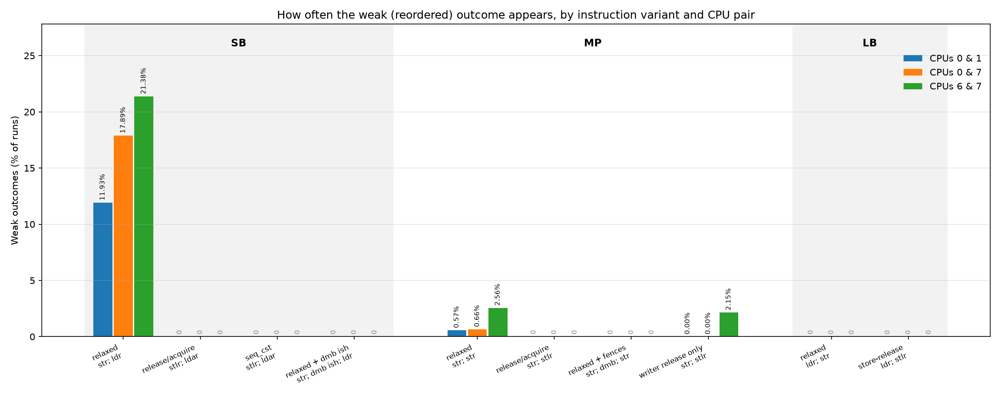
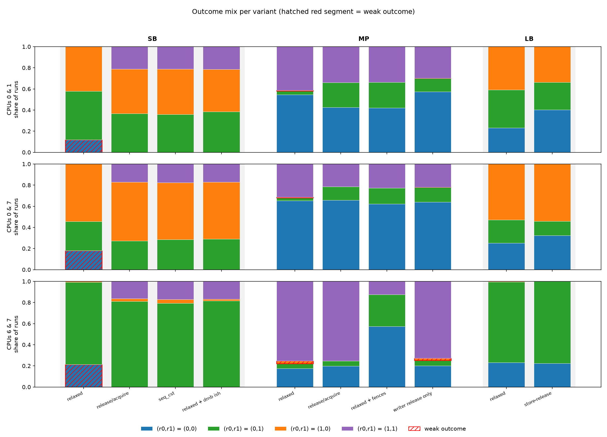
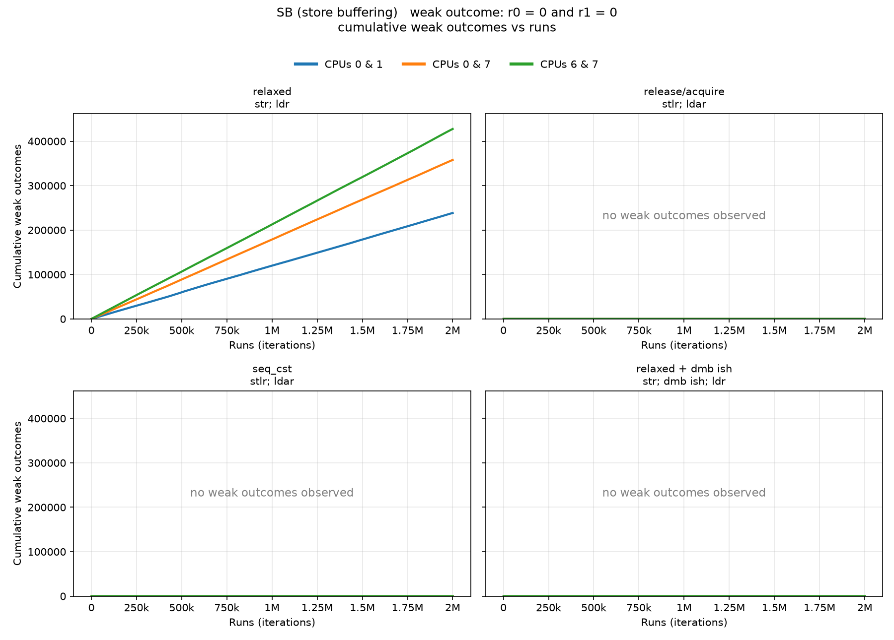
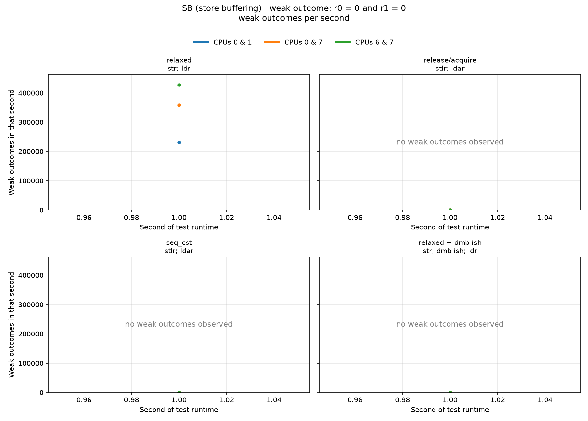
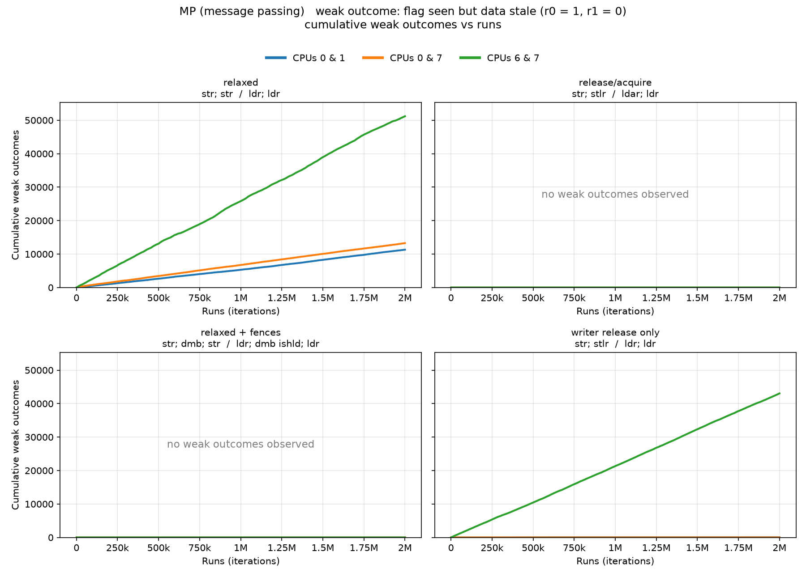
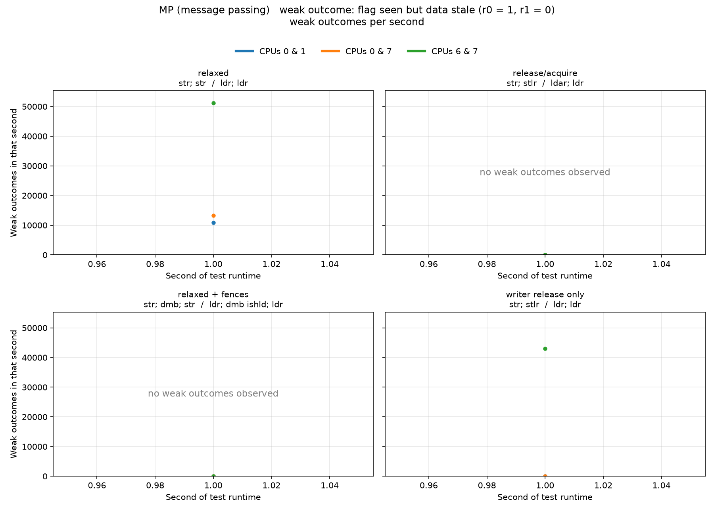
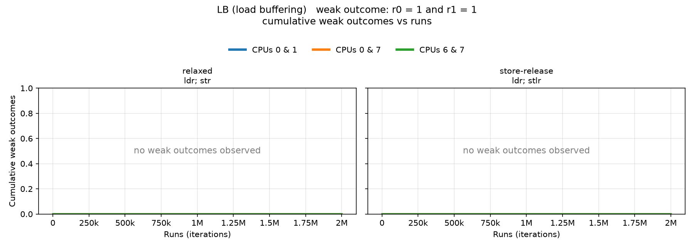
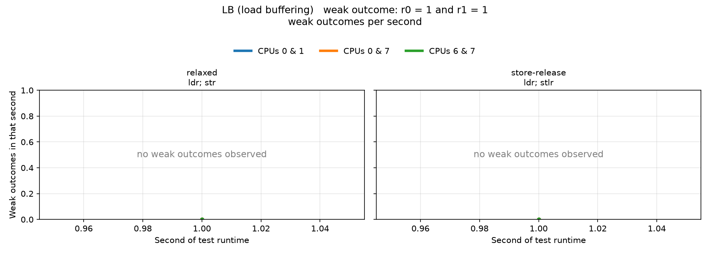

# Observing Memory Reordering on ARM (AArch64)

CPUs reorder memory operations. This repo catches it happening on an AArch64 Android phone. It also shows which C++ memory orders and fences stop it.

It builds on the idea in Jeff Preshing's *Memory Reordering Caught in the Act*, with ARM litmus tests (SB, MP, LB) and a file of tiny atomic functions for reading the assembly.

---

## Contents

| File | Purpose |
|---|---|
| `plot_litmus.py` | Plots the ARM litmus results for several CPU pairs on shared graphs, plus summary comparison graphs |
| `arm-litmus.cpp` | ARM litmus tests: SB, MP, LB, each with several memory orders and fences |
| `arm-atomics.cpp` | One tiny function per atomic operation, for reading the assembly |
| `arm-atomics.s` | AArch64 assembly (ARMv8.0, GCC 13) |
| `arm-atomics-lse.s` | AArch64 assembly with `-march=armv8.1-a` (LSE atomics) |
| `arm_memory_model.md` | Short notes on what a memory model is and how ARM compares with x86 |
| `litmus_results/` | Raw ARM litmus data: `summary.txt` plus one folder per CPU pair (`cpu0-1`, `cpu6-7`, `cpu0-7`) |
| `plots/` | Generated figures (see [section 5](#5-results-by-cpu-pair-pinned-runs)) |

---

## Test environment

All ARM results come from this phone:

| | |
|---|---|
| SoC | MediaTek Dimensity 7400 Ultra 5G (4 nm) |
| CPU | Octa-core (8 cores / 8 threads), up to 2.6 GHz: 4x Cortex-A78 at 2.6 GHz + 4x Cortex-A55 at 2.0 GHz (ARMv8.2-A) |
| GPU | Arm Mali-G615 MP2 |
| RAM | 6 GB |
| OS / shell | Android, Termux |
| Compiler | `clang++ -O2 -std=c++17 -pthread` |

Cortex-A78 and Cortex-A55 both implement ARMv8.2-A, so the ARMv8 memory model discussed here applies directly.
The chip is a big.LITTLE design: four big Cortex-A78 cores and four little Cortex-A55 cores. On most phones the
A55 cores are CPUs 0 to 3 and the A78 cores are CPUs 4 to 7. That would make CPUs 0 & 1 a little-to-little pair,
CPUs 6 & 7 a big-to-big pair and CPUs 0 & 7 a cross-cluster pair.
Check the numbering on your own device with the command below.

To see which CPU numbers sit in which clock tier on your own device:

```
for c in /sys/devices/system/cpu/cpu[0-7]; do echo "$(basename $c) $(cat $c/cpufreq/cpuinfo_max_freq)"; done
```

---

## 1. Background: memory models

A CPU or compiler can reorder memory operations as long as a single thread can't tell the difference. Another thread can. That is why concurrent code needs ordering rules.

| | x86-64 | ARMv8 (AArch64) |
|---|---|---|
| Model | Total Store Order (TSO), "strong" | Relaxed, "weak" |
| Load → Load reordering | No | **Yes** |
| Load → Store reordering | No | **Yes** |
| Store → Store reordering | No | **Yes** |
| Store → Load reordering | **Yes** | **Yes** |
| Store atomicity | Multicopy atomic | Multicopy atomic since the ARMv8 revision (older ARM was not) |

x86 only reorders **Store → Load**. The cause is the store buffer. ARM allows all four combinations. Code that works on x86 by accident can break on ARM.

ARM has a formal concurrency model. The architecture was revised to be multicopy atomic, and a formal model was added to the spec (Pulte et al., POPL 2018, see References).

### Ordering tools on AArch64

| C++ construct | AArch64 instruction | What it guarantees |
|---|---|---|
| `relaxed` load / store | `ldr` / `str` | Atomic, but no ordering |
| `acquire` load | `ldar` | Later accesses cannot move before it |
| `release` store | `stlr` | Earlier accesses cannot move after it |
| `seq_cst` load / store | `ldar` / `stlr` | Same instructions as acquire / release on ARMv8 |
| `atomic_thread_fence(seq_cst)` | `dmb ish` | Full barrier |
| `atomic_thread_fence(acquire)` | `dmb ishld` | Orders earlier loads before later loads and stores |
| `atomic_thread_fence(release)` | `dmb ish` (GCC) | Orders earlier accesses before later stores |
| `fetch_add(seq_cst)` | `ldaddal` (LSE) or `ldxr`/`stxr` loop | Atomic read-modify-write |
| `exchange(seq_cst)` | `swpal` (LSE) | Atomic swap |
| `compare_exchange(seq_cst)` | `casal` (LSE) | Compare and swap |

Notes from the generated assembly:

- ARMv8 hardware orders `stlr` before a later `ldar`, though the C++ standard doesn't promise that for release/acquire. That is why "SB release/acquire" shows zero weak outcomes below.
- GCC 10.1+ uses outline atomics on AArch64 by default, so plain `fetch_add` calls a helper like `__aarch64_ldadd4_acq_rel`. Compile with `-mno-outline-atomics` to see the inline `ldxr`/`stxr` loop.
- `asm volatile("" ::: "memory")` emits no instruction. It only stops the **compiler** from reordering.

---

## 2. ARM litmus tests

`arm-litmus.cpp` runs three classic tests. Each has two threads, a spin barrier to start them together, and a random start offset (0 to 127 nop steps) to try different alignments. Each run records `(r0, r1)`. The **weak outcome** is the one sequentially consistent execution can never produce.

| Test | Thread 0 | Thread 1 | Weak outcome |
|---|---|---|---|
| **SB** (store buffering) | `x = 1; r0 = y` | `y = 1; r1 = x` | `r0 == 0 && r1 == 0` |
| **MP** (message passing) | `data = 1; flag = 1` | `r0 = flag; r1 = data` | `r0 == 1 && r1 == 0` |
| **LB** (load buffering) | `r0 = x; y = 1` | `r1 = y; x = 1` | `r0 == 1 && r1 == 1` |

Variants tested:

| Test | Variants |
|---|---|
| SB | relaxed, release/acquire, seq_cst, relaxed with `dmb ish` |
| MP | relaxed, release/acquire, relaxed with fences, writer-only release |
| LB | relaxed, store-release |

### Build and run (Termux on Android)

```
pkg install clang
cp arm-litmus.cpp ~/ && cd ~
clang++ -O2 -std=c++17 -pthread arm-litmus.cpp -o litmus

./litmus 2000000                 # one unpinned run of every test
./litmus 2000000 0:1 2:5 6:7     # one run per CPU pair (thread 0 on the first CPU, thread 1 on the second)
./litmus 2000000 auto            # pick three pairs automatically (see below)
./litmus 2000000 auto run2       # same, writing into ./run2 instead of ./results
```

`auto` reads each CPU's max frequency from `/sys/devices/system/cpu/cpuN/cpufreq/` and picks three pairs: the two slowest CPUs, the two fastest, and one slow plus one fast. On a big.LITTLE phone that compares little-to-little, big-to-big and cross-cluster. If the frequencies can't be read, or all CPUs are equal, it falls back to `0:1`, `(n-2):(n-1)` and `0:(n-1)`. The chosen pairs are printed at the start. Each test runs once per pair, so three pairs take about three times as long.

Build and run from Termux's home directory. Shared storage like `Download` is mounted non-executable and gives `Permission denied`.

### Result files and plotting

After each run, `arm-litmus.cpp` writes one folder per CPU pair and one sub-folder per test:

```
results/
  summary.txt                 one line per (pair, test): iterations, weak count, weak %, runtime, all four outcome counts
  cpu0-1/
    SB_relaxed/
      reorders_vs_runs.txt        "runs cumulative_reorders", sampled every 1,000 runs
      reorders_per_second.txt     "second reorders runs_in_that_second"
    SB_release_acquire/ ...
    MP_relaxed/ ...
  cpu6-7/ ...
  cpu0-7/ ...
```

Plot everything with `plot_litmus.py`. Each CPU pair gets its own colour on every graph:

```
pip install numpy matplotlib
python plot_litmus.py results            # writes PNGs into ./plots
python plot_litmus.py results --show     # also opens the windows
```

| Figure | What it shows |
|---|---|
| `SB_cumulative.png`, `MP_cumulative.png`, `LB_cumulative.png` | Cumulative weak outcomes vs runs. One panel per instruction variant, one line per CPU pair, shared y-axis so variants compare directly |
| `SB_per_second.png`, `MP_per_second.png`, `LB_per_second.png` | Weak outcomes in each second of runtime, same layout. The last (partial) second is dropped |
| `rate_by_instruction.png` | Weak-outcome percentage for all ten variants, grouped by test, one bar per CPU pair |
| `outcome_mix.png` | Share of runs in each `(r0,r1)` outcome per variant, one row per CPU pair, weak outcome hatched in red |

The script also prints a table of weak-outcome percentages (variants against CPU pairs). Variants
with no weak outcomes show a flat zero line labelled "no weak outcomes observed".

The per-second graphs show how the rate changes during a test, for example a warm-up spike. Pairs run at different speeds, so compare overall rates with the percentage graphs, not raw counts. To keep separate runs, give an output folder (`./litmus 2000000 auto run2`) and plot it with
`python plot_litmus.py run2 --out plots_run2`.

To read the assembly:

```
g++ -O2 -S arm-atomics.cpp -o arm-atomics.s
g++ -O2 -S -march=armv8.1-a arm-atomics.cpp -o arm-atomics-lse.s
```

---

## 3. Terminal output

Device: the phone from [Test environment](#test-environment), 8 hardware threads, no pinning, 2,000,000 iterations per test.

```
Architecture: AArch64, hardware threads: 8, iterations per test: 2000000
Pinning: none (pass two CPU numbers to pin)
Outcome columns are (r0,r1). The weak outcome is marked with '*'.

SB relaxed               [str; ldr]
   (0,0)*=414980    (0,1) =1583956   (1,0) =1063      (1,1) =1
   weak outcome: 414980 of 2000000 (20.7490%)  -> OBSERVED

SB release/acquire       [stlr; ldar]
   (0,0)*=0         (0,1) =1701452   (1,0) =9616      (1,1) =288932
   weak outcome: 0 of 2000000 (0.0000%)  -> not observed

SB seq_cst               [stlr; ldar]
   (0,0)*=0         (0,1) =1700189   (1,0) =9225      (1,1) =290586
   weak outcome: 0 of 2000000 (0.0000%)  -> not observed

SB relaxed + dmb ish     [str; dmb ish; ldr]
   (0,0)*=0         (0,1) =1691302   (1,0) =11401     (1,1) =297297
   weak outcome: 0 of 2000000 (0.0000%)  -> not observed

MP relaxed               [str; str  /  ldr; ldr]
   (0,0) =314887    (0,1) =42553     (1,0)*=69897     (1,1) =1572663
   weak outcome: 69897 of 2000000 (3.4949%)  -> OBSERVED

MP release/acquire       [str; stlr  /  ldar; ldr]
   (0,0) =311270    (0,1) =71631     (1,0)*=0         (1,1) =1617099
   weak outcome: 0 of 2000000 (0.0000%)  -> not observed

MP relaxed + fences      [str; dmb; str  /  ldr; dmb ishld; ldr]
   (0,0) =406951    (0,1) =1219239   (1,0)*=0         (1,1) =373810
   weak outcome: 0 of 2000000 (0.0000%)  -> not observed

MP only writer release   [str; stlr  /  ldr; ldr (reader weak)]
   (0,0) =343869    (0,1) =45807     (1,0)*=35202     (1,1) =1575122
   weak outcome: 35202 of 2000000 (1.7601%)  -> OBSERVED

LB relaxed               [ldr; str]
   (0,0) =424077    (0,1) =1575184   (1,0) =739       (1,1)*=0
   weak outcome: 0 of 2000000 (0.0000%)  -> not observed

LB store-release         [ldr; stlr]
   (0,0) =430820    (0,1) =1568230   (1,0) =950       (1,1)*=0
   weak outcome: 0 of 2000000 (0.0000%)  -> not observed
```

---

## 4. Results (unpinned run)

Counts are out of 2,000,000 iterations per test. The weak outcome is marked with `*`.

### Summary

| Test | Variant | Instructions | Weak outcome count | Weak rate | Verdict |
|---|---|---|---:|---:|---|
| SB | relaxed | `str; ldr` | 414,980 | 20.7490% | **Observed** |
| SB | release/acquire | `stlr; ldar` | 0 | 0% | Not observed |
| SB | seq_cst | `stlr; ldar` | 0 | 0% | Not observed |
| SB | relaxed + `dmb ish` | `str; dmb ish; ldr` | 0 | 0% | Not observed |
| MP | relaxed | `str; str` / `ldr; ldr` | 69,897 | 3.4949% | **Observed** |
| MP | release/acquire | `str; stlr` / `ldar; ldr` | 0 | 0% | Not observed |
| MP | relaxed + fences | `str; dmb; str` / `ldr; dmb ishld; ldr` | 0 | 0% | Not observed |
| MP | writer release only | `str; stlr` / `ldr; ldr` | 35,202 | 1.7601% | **Observed** |
| LB | relaxed | `ldr; str` | 0 | 0% | Not observed |
| LB | store-release | `ldr; stlr` | 0 | 0% | Not observed |

### Full outcome counts

| Test | Variant | (0,0) | (0,1) | (1,0) | (1,1) |
|---|---|---:|---:|---:|---:|
| SB | relaxed | **414,980\*** | 1,583,956 | 1,063 | 1 |
| SB | release/acquire | 0\* | 1,701,452 | 9,616 | 288,932 |
| SB | seq_cst | 0\* | 1,700,189 | 9,225 | 290,586 |
| SB | relaxed + `dmb ish` | 0\* | 1,691,302 | 11,401 | 297,297 |
| MP | relaxed | 314,887 | 42,553 | **69,897\*** | 1,572,663 |
| MP | release/acquire | 311,270 | 71,631 | 0\* | 1,617,099 |
| MP | relaxed + fences | 406,951 | 1,219,239 | 0\* | 373,810 |
| MP | writer release only | 343,869 | 45,807 | **35,202\*** | 1,575,122 |
| LB | relaxed | 424,077 | 1,575,184 | 739 | 0\* |
| LB | store-release | 430,820 | 1,568,230 | 950 | 0\* |

---

## 5. Results by CPU pair (pinned runs)

Same tests, but the two threads are pinned to specific CPUs. 2,000,000 iterations per test, per pair. 🟥 means the weak (reordered) outcome was seen. 🟩 means never seen. Raw data is in [`litmus_results/`](litmus_results/). Figures are in [`plots/`](plots/), made by `plot_litmus.py`.

### At a glance: weak-outcome rate

| Test | Variant | Instructions | CPUs 0 & 1 | CPUs 6 & 7 | CPUs 0 & 7 |
|---|---|---|---:|---:|---:|
| SB | relaxed | `str; ldr` | 🟥 **11.9253%**<br><sub>238,506</sub> | 🟥 **21.3815%**<br><sub>427,629</sub> | 🟥 **17.8945%**<br><sub>357,890</sub> |
| SB | release/acquire | `stlr; ldar` | 🟩 0 | 🟩 0 | 🟩 0 |
| SB | seq_cst | `stlr; ldar` | 🟩 0 | 🟩 0 | 🟩 0 |
| SB | relaxed + `dmb ish` | `str; dmb ish; ldr` | 🟩 0 | 🟩 0 | 🟩 0 |
| MP | relaxed | `str; str` / `ldr; ldr` | 🟥 **0.5653%**<br><sub>11,306</sub> | 🟥 **2.5596%**<br><sub>51,192</sub> | 🟥 **0.6633%**<br><sub>13,266</sub> |
| MP | release/acquire | `str; stlr` / `ldar; ldr` | 🟩 0 | 🟩 0 | 🟩 0 |
| MP | relaxed + fences | `str; dmb; str` / `ldr; dmb ishld; ldr` | 🟩 0 | 🟩 0 | 🟩 0 |
| MP | writer release only | `str; stlr` / `ldr; ldr` | 🟥 **0.0040%**<br><sub>79</sub> | 🟥 **2.1524%**<br><sub>43,049</sub> | 🟥 **0.0006%**<br><sub>11</sub> |
| LB | relaxed | `ldr; str` | 🟩 0 | 🟩 0 | 🟩 0 |
| LB | store-release | `ldr; stlr` | 🟩 0 | 🟩 0 | 🟩 0 |

> **Short version:** only the unordered variants break. Anything with `stlr`/`ldar` on both sides, or a `dmb` fence, stayed at zero on all three pairs. *Writer release only* is the trap. It still leaks on CPUs 6 & 7 because the reader is plain `ldr; ldr`.

### Weak-outcome rate by instruction and CPU pair



SB relaxed sits between 12% and 21%. MP relaxed sits between 0.6% and 2.6%. Everything with proper ordering is flat at zero. The CPU pair changes how big the effect is, not which variants are affected. The one oddity is MP writer-release-only: 79 and 11 hits on two pairs, but clearly visible on 6 & 7.

### Where every run ended up



Each bar is 100% of the runs for one variant, split into the four `(r0,r1)` outcomes. The red hatched part is the weak outcome. The rest of the mix differs a lot between pairs. SB on CPUs 6 & 7 is mostly `(0,1)`. On CPUs 0 & 7 it is split between `(0,1)` and `(1,0)`. That comes from which thread the harness starts first, not from the memory model. So use the rate graphs to compare pairs, not this one.

### Store buffering (SB)



The relaxed curves are straight lines. The weak outcome happens at a steady rate for the whole run, not in bursts. Release/acquire, `seq_cst` and `dmb ish` are all empty.

<details>
<summary>SB weak outcomes per second</summary>



</details>

### Message passing (MP)



<details>
<summary>MP weak outcomes per second</summary>



Each test finishes in about one second (0.55 to 1.3 s), so these graphs have only one or two points per line. They become useful on longer runs, e.g. `./litmus 20000000 auto`.

</details>

### Load buffering (LB)



<details>
<summary>LB weak outcomes per second</summary>



</details>

Both LB variants are empty on all pairs. Same as the unpinned run.

### Full outcome counts per pair

<details>
<summary>Show all 30 rows (the weak outcome is marked with *)</summary>

| Pair | Test | Variant | (0,0) | (0,1) | (1,0) | (1,1) | Runtime |
|---|---|---|---:|---:|---:|---:|---:|
| CPUs 0 & 1 | SB | relaxed | **238,506\*** | 920,408 | 840,609 | 477 | 1.032 s |
| CPUs 0 & 1 | SB | release/acquire | 0\* | 734,278 | 842,149 | 423,573 | 1.103 s |
| CPUs 0 & 1 | SB | seq_cst | 0\* | 715,930 | 860,605 | 423,465 | 1.082 s |
| CPUs 0 & 1 | SB | relaxed + `dmb ish` | 0\* | 769,922 | 800,107 | 429,971 | 1.072 s |
| CPUs 0 & 1 | MP | relaxed | 1,092,130 | 69,155 | **11,306\*** | 827,409 | 1.046 s |
| CPUs 0 & 1 | MP | release/acquire | 848,294 | 471,459 | 0\* | 680,247 | 1.281 s |
| CPUs 0 & 1 | MP | relaxed + fences | 839,866 | 486,495 | 0\* | 673,639 | 1.174 s |
| CPUs 0 & 1 | MP | writer release only | 1,147,513 | 256,694 | **79\*** | 595,714 | 1.073 s |
| CPUs 0 & 1 | LB | relaxed | 464,696 | 719,453 | 815,851 | 0\* | 1.041 s |
| CPUs 0 & 1 | LB | store-release | 804,914 | 519,086 | 676,000 | 0\* | 1.133 s |
| CPUs 6 & 7 | SB | relaxed | **427,629\*** | 1,557,647 | 14,723 | 1 | 0.561 s |
| CPUs 6 & 7 | SB | release/acquire | 0\* | 1,620,740 | 49,914 | 329,346 | 0.634 s |
| CPUs 6 & 7 | SB | seq_cst | 0\* | 1,586,139 | 69,617 | 344,244 | 0.634 s |
| CPUs 6 & 7 | SB | relaxed + `dmb ish` | 0\* | 1,633,959 | 29,679 | 336,362 | 0.625 s |
| CPUs 6 & 7 | MP | relaxed | 349,815 | 92,104 | **51,192\*** | 1,506,889 | 0.547 s |
| CPUs 6 & 7 | MP | release/acquire | 397,827 | 97,757 | 0\* | 1,504,416 | 0.554 s |
| CPUs 6 & 7 | MP | relaxed + fences | 1,144,890 | 603,028 | 0\* | 252,082 | 0.590 s |
| CPUs 6 & 7 | MP | writer release only | 402,995 | 99,647 | **43,049\*** | 1,454,309 | 0.576 s |
| CPUs 6 & 7 | LB | relaxed | 464,379 | 1,526,206 | 9,415 | 0\* | 0.626 s |
| CPUs 6 & 7 | LB | store-release | 445,978 | 1,551,055 | 2,967 | 0\* | 0.650 s |
| CPUs 0 & 7 | SB | relaxed | **357,890\*** | 555,898 | 1,085,849 | 363 | 0.795 s |
| CPUs 0 & 7 | SB | release/acquire | 0\* | 544,045 | 1,112,629 | 343,326 | 0.866 s |
| CPUs 0 & 7 | SB | seq_cst | 0\* | 572,027 | 1,076,569 | 351,404 | 0.837 s |
| CPUs 0 & 7 | SB | relaxed + `dmb ish` | 0\* | 578,666 | 1,079,324 | 342,010 | 0.841 s |
| CPUs 0 & 7 | MP | relaxed | 1,302,744 | 57,712 | **13,266\*** | 626,278 | 0.786 s |
| CPUs 0 & 7 | MP | release/acquire | 1,315,285 | 257,339 | 0\* | 427,376 | 0.844 s |
| CPUs 0 & 7 | MP | relaxed + fences | 1,245,476 | 299,738 | 0\* | 454,786 | 0.843 s |
| CPUs 0 & 7 | MP | writer release only | 1,280,292 | 281,009 | **11\*** | 438,688 | 0.842 s |
| CPUs 0 & 7 | LB | relaxed | 501,751 | 443,171 | 1,055,078 | 0\* | 0.832 s |
| CPUs 0 & 7 | LB | store-release | 644,085 | 271,448 | 1,084,467 | 0\* | 0.863 s |

</details>

---

## 6. Analysis

- **SB relaxed (20.7%).** Plain `str` then `ldr`. The load finishes before the store is visible. Same Store → Load reordering as x86.
- **SB with `stlr`/`ldar` is clean.** ARMv8 hardware orders a release store before a later acquire load. That is stricter than C++ requires. `dmb ish` forbids the outcome outright.
- **MP relaxed (3.5%)** can't happen on x86. Either the writer's two stores reach other cores out of order, or the reader's two loads run out of order, or both.
- **MP release/acquire and MP with fences are clean.** Order both sides and it's fixed.
- **MP writer-release-only (1.76%)** is the practical lesson. A correct writer doesn't help if the reader uses plain loads. The reader's `ldr; ldr` can still reorder.
- **CPU pair changes the rate, not the verdict.** SB relaxed goes from 11.9% (CPUs 0 & 1) to 21.4% (CPUs 6 & 7). Every ordered variant is zero on all three pairs.
- **Writer-release-only depends on the pair.** 43,049 hits (2.15%) on CPUs 6 & 7, but only 79 and 11 on CPUs 0 & 1 and 0 & 7. Test only one of those pairs and this broken code looks safe. That is why several pairs matter.
- **LB at zero.** The architecture allows load buffering. This chip doesn't show it, or it is too rare to catch. Zero here doesn't mean forbidden.

### Reading the other outcome columns

In SB relaxed, almost all non-weak runs land in `(0,1)` (about 1.58M) and almost none in `(1,0)` (1,063). So thread 0 usually ran before thread 1. The spin barrier is not symmetric. The weak outcomes come from runs where the threads really overlapped. The fenced SB variants show about 290k runs in `(1,1)`. That is where overlapping runs end up once the weak outcome is forbidden. So the rates belong to this harness and this device. They are not universal.

---

## 7. Caveats

- **Only three CPU pairs.** Section 5 pins to CPUs 0 & 1, 6 & 7 and 0 & 7. Section 4 is the older unpinned run, so don't compare the two directly. Android may refuse affinity changes. Then the program prints a warning and runs unpinned.
- **Empirical only.** "Not observed" is what this chip did in these runs. It is not what the architecture forbids. For that, use the formal model tool [rmem](https://www.cl.cam.ac.uk/~sf502/regressions/rmem/). It needs the tests written as AArch64 assembly litmus files.
- **Asymmetric start.** The harness skews which thread starts first, as described above.
- **Run-to-run variation.** Temperature, background load and frequency scaling change the results. Repeat runs before comparing small differences.

---

## References

- Pulte, Flur, Deacon, French, Sarkar, Sewell. *Simplifying ARM Concurrency: Multicopy-Atomic Axiomatic and Operational Models for ARMv8.* POPL 2018. https://www.cl.cam.ac.uk/~pes20/armv8-mca
- Preshing. *Weak vs. Strong Memory Models.* https://preshing.com/20120930/weak-vs-strong-memory-models
- Preshing. *Memory Reordering Caught in the Act* (source of the original test). https://preshing.com/20120515/memory-reordering-caught-in-the-act/
- Arm Learning Paths. *Learn about the C++ memory model for porting applications to Arm.* https://learn.arm.com/learning-paths/servers-and-cloud-computing/arm-cpp-memory-model/1/
- Zhang et al. *Weak Memory Models: Balancing Definitional Simplicity and Implementation Flexibility.* https://arxiv.org/pdf/1707.05923
- Intel. *Intel 64 Architecture Memory Ordering White Paper* (x86 reordering rules, document 318147). https://www.cs.cmu.edu/~410-f10/doc/Intel_Reordering_318147.pdf
- rmem: interactive tool for the formal ARM, POWER and RISC-V concurrency models. https://www.cl.cam.ac.uk/~sf502/regressions/rmem/